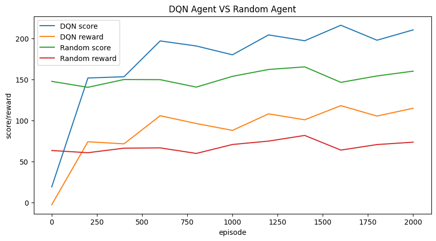

# **强化学习——DQN玩合成大西瓜**
**作者：** [莱可可](https://github.com/RedContritio)<br>
**日期：** 2022.11 <br>
**摘要：** 使用 DQN 算法训练 AI 玩合成大西瓜

## **一、介绍**
本案例展示了使用DQN玩合成大西瓜的一个实现。

### Deep Q-Network (DQN 算法)

DQN 是基于深度学习的 Q 学习算法，主要结合了值函数近似和神经网络技术，并采用目标网络和经验回放的方法进行训练。
- 目标网络：使用一个固定的 Q 神经网络来计算目标值，这样可以减少训练时的波动。
- 经验回放：将经验存储在一个缓冲区中，然后从缓冲区中随机采样，这样可以减少相关性，使得训练更加稳定。


### 合成大西瓜
合成大西瓜玩法与《2048》《俄罗斯方块》类似，两个相同类别的水果碰撞后，合成成为更大的新水果。其中共有11种水果，最终目标是合成大西瓜。
agent需要学会将水果从合适的位置放下，使水果能顺利合成。

## **二、环境配置**

本教程依赖的非 python 官方包如下：

- `pymunk`: python 2D物理引擎，用于处理物体碰撞等运动
- `opencv-python`: 图形库，用于绘制界面与交互
- `numpy`: 数值计算库，主要用于图像处理和模型数据处理


```python
%pip install paddlepaddle pymunk opencv-python numpy matplotlib
```

```python
import os
import random
import typing
import enum
import collections
import pymunk
from threading import Lock
import base64
import math
import datetime

%matplotlib inline
import matplotlib.pyplot as plt

import cv2

import numpy as np

import paddle
from paddle import nn
from paddle import optimizer
```

## **三、实现游戏本体**

### 3.1 事件系统

事件系统是对游戏与用户交互的抽象，包括鼠标点击与鼠标移动。


```python
class EventType(enum.Enum):
    LBUTTONDOWN = (1,)
    MOUSEMOVE = (2,)
    RBUTTONDOWN = (3,)


class Event:
    def __init__(self, type: EventType):
        self.type = type


class MouseEvent(Event):
    def __init__(self, type: EventType, pos: typing.Tuple[int, int]):
        self.pos = pos
        super().__init__(type)


# 事件系统基类
class GameEventBase:
    def __init__(self):
        self.__events = []

    def add_event(self, event: Event):
        self.__events.append(event)

    @property
    def events(self) -> typing.List[Event]:
        _events = self.__events[:]
        self.__events.clear()
        return _events
```

### 3.2 图像渲染

游戏的图形界面绘制需要一些辅助函数，如下：

- `mix`: 将 `background` 和 `foreground` 基于透明度混合（并给 `foreground` 额外乘算 `alpha` 的透明度），直接在 `background` 上修改
- `cover`: 将 `foreground` 基于透明度覆盖到 `background` 上（并给 `foreground` 额外乘算 `alpha` 的透明度），直接在 `background` 上修改
- `intersectRect`: 计算两个矩形框 `(x, y, w, h)` 的相交矩形框 `(ix, iy, iw, ih)`
- `putText2`: 在 `image` 上以 `center` 为中心，绘制文字 `text` （用法同 `cv2.putText` ）
- `putInverseColorText`: 在 `image` 上基于 `pos` 点，调用 `putTextFunc` 绘制文字 `text`，文字与 `image` 反色


```python
def mix(background: np.ndarray, foreground: np.ndarray, alpha: float = 1.0) -> None:
    alpha_back = background[:, :, 3] / 255.0
    alpha_fore = (foreground[:, :, 3] / 255.0) * alpha

    for c in range(3):
        background[:, :, c] = np.ubyte(
            alpha_fore * foreground[:, :, c]
            + alpha_back * background[:, :, c] * (1 - alpha_fore)
        )
    background[:, :, 3] = np.ubyte((1 - (1 - alpha_fore) * (1 - alpha_back)) * 255)


def cover(background: np.ndarray, foreground: np.ndarray, alpha: float = 1.0) -> None:
    foreground_colors = foreground[:, :, :3]
    alpha_channel = (foreground[:, :, 3] / 255.0) * alpha
    alpha_mask = np.dstack((alpha_channel, alpha_channel, alpha_channel))

    background[:, :, :3] = (
        background[:, :, :3] * (1 - alpha_mask) + foreground_colors * alpha_mask
    )


def intersectRect(rect1: typing.List[int], rect2: typing.List[int]) -> typing.List[int]:
    l1, t1, b1, h1 = rect1
    r1, b1 = l1 + b1, t1 + h1
    l2, t2, b2, h2 = rect2
    r2, b2 = l2 + b2, t2 + h2

    l, r = max(l1, l2), min(r1, r2)
    t, b = max(t1, t2), min(b1, b2)

    return [l, t, max(0, r - l), max(0, b - t)]


def putText2(
    image: np.ndarray,
    text: str,
    center: typing.List[int],
    font_face: int = 0,
    font_scale: float = 1.0,
    color: typing.List[int] = (255, 255, 255),
    thickness: int = 1,
) -> None:
    INNER_LINE_MARGIN = 5
    x, y = center
    lines = text.splitlines()

    sizes = [
        cv2.getTextSize(line, font_face, font_scale, thickness)[0] for line in lines
    ]

    h_sum = sum([size[1] for size in sizes]) + (len(sizes) - 1) * INNER_LINE_MARGIN
    w_max = max([size[0] for size in sizes])

    y_base = y - h_sum // 2

    for i, (w, h) in enumerate(sizes):
        cv2.putText(
            image,
            lines[i],
            (x - w // 2, y_base),
            font_face,
            font_scale,
            color,
            thickness,
        )
        y_base += h + INNER_LINE_MARGIN


def putInverseColorText(
    image: np.ndarray,
    text: str,
    pos: typing.List[int],
    font_face: int = 0,
    font_scale: float = 1.0,
    thickness: int = 1,
    putTextFunc: typing.Callable = putText2,
) -> None:
    mask = np.zeros((*image.shape[:2], 3), dtype=np.uint8)
    putTextFunc(mask, text, pos, font_face, font_scale, (255, 255, 255), thickness)

    image[:, :, :3] = mask + (2 * (0.5 - mask / 255.0)) * image[:, :, :3]
```

### 3.3 伪随机数生成器

自定义伪随机数生成器，便于控制随机过程


```python
class PRNG:
    def __init__(self):
        self.s = 1234
        self.p = 999979
        self.q = 999983
        self.m = self.p * self.q

    def hash(self, x: any):
        y = base64.encodebytes(bytes(str(x).encode("utf8")))
        z = 0
        for i, v in enumerate(y):
            z += v * math.pow(128, i)
        return z

    def seed(self, seed: any = datetime.datetime.now()):
        y = 0
        z = 0
        while y % self.p == 0 or y % self.q == 0 or y == 0 or y == 1:
            y = (self.hash(seed) + z) % self.m
            z += 1

        self.s = y

        [self.next() for _ in range(10)]

    def next(self):
        self.s = (self.s * self.s) % self.m
        return self.s / self.m

    def random(self, l: float = 0, r: float = 1):
        return self.next() * (r - l) + l

    def randint(self, l: int = 0, r: int = 2):
        return int(math.ceil(self.random(l, r)))

    def randsign(self) -> int:
        return -1 if self.random() > 0.5 else 1
```

### 3.4 实现水果类

#### 3.4.1 水果参数

定义各种水果的半径、尺寸与对应图片。


```python
# list[0] is nonsense for type 0
FRUIT_RADIUS = [int(1.5 * r) for r in [-1, 10, 15, 21, 23, 29, 35, 37, 50, 59, 60, 78]]
FRUIT_SIZES = [(2 * r, 2 * r) for r in FRUIT_RADIUS]

FRUIT_IMAGE_PATHS = [f"res/{i:02d}.png" for i in range(11)]
FRUIT_RAW_IMAGES = [
    cv2.imread(FRUIT_IMAGE_PATHS[i], -1) if i > 0 else None for i in range(11)
]

FRUIT_IMAGES = [
    None if img is None else cv2.resize(img, FRUIT_SIZES[i])
    for i, img in enumerate(FRUIT_RAW_IMAGES)
]
```

#### 3.4.2 水果类定义

定义所有水果的类 `class Fruit`。

每个水果对应一个该类型实例，主要用于描述水果对象的位置。

其中，水果的种类 `type` 为 `[1, 11]`，其中 `1` 是葡萄，`11` 是大西瓜。

当两个种类为 `x` 的水果碰撞时，合成出一个种类为 `x+1` 的新水果，并在游戏中获得 `x+1` 分；

特别的，当 `x` 为 `10` 时，合成出的新水果为 `11` （大西瓜），并在游戏中获得 `100` 分。


```python
class Fruit:
    def __init__(self, type: int, x: int, y: int) -> None:
        self.type = type
        self.r = FRUIT_RADIUS[self.type]
        self.size = FRUIT_SIZES[self.type]

        self.x, self.y = x, y

    def update_position(self, x: int, y: int) -> None:
        self.x, self.y = x, y

    def draw(self, screen: np.ndarray) -> None:
        Fruit.paint(screen, self.type, self.x, self.y)

    def paint(
        screen: np.ndarray, type: int, x: int, y: int, alpha: float = 1.0
    ) -> None:
        assert type > 0 and type <= 11
        l, t = (x - FRUIT_RADIUS[type], y - FRUIT_RADIUS[type])
        w, h = FRUIT_SIZES[type]

        l, t, w, h = [int(v) for v in (l, t, w, h)]

        il, it, iw, ih = [
            int(v) for v in intersectRect((l, t, w, h), (0, 0, *screen.shape[1::-1]))
        ]

        cover(
            screen[it : it + ih, il : il + iw],
            FRUIT_IMAGES[type][it - t : it - t + ih, il - l : il - l + iw],
            alpha=alpha,
        )
```

### 3.5 游戏本体


```python
# 物理引擎重力
GRAVITY = (0, 800)
# 游戏场景大小
GAME_RESOLUTION = GAME_WIDTH, GAME_HEIGHT = 300, 400
```


```python
class GameCore(GameEventBase):
    def __init__(self, gravity: typing.Tuple[int, int] = GRAVITY) -> None:
        self.resolution = self.width, self.height = GAME_WIDTH, GAME_HEIGHT
        self.init_x = int(self.width / 2)
        self.init_y = int(0.15 * self.height)

        self.score = 0
        self.recent_score_delta = 0

        self.fruits: typing.List[Fruit] = []
        self.balls: typing.List[pymunk.Shape] = []

        self.background_color = (0xE1, 0x69, 0x41, 0)
        self.preset_background = np.zeros((self.height, self.width, 4), dtype=np.uint8)
        self.preset_background[:, :] = self.background_color
        self.preset_redline_screen = self.preset_background.copy()
        cv2.line(
            self.preset_redline_screen,
            (0, self.init_y),
            (self.width, self.init_y),
            (0, 0, 255),
            2,
        )
        self.__screen = self.preset_background.copy()

        self.lock = Lock()
        self.render_lock = Lock()

        self.prng = PRNG()

        self.stable_frame_threshold = 10
        self.current_frame_id = 0
        self.stable_frame_id = self.current_frame_id - self.stable_frame_threshold
        self.clickable = False

        self.largest_fruit_type = 1
        self.current_fruit_type = self.create_random_fruit_type()

        self.reset()

        self.space = pymunk.Space()
        self.space.gravity = gravity

        self.reset()

        self.init_segment()
        self.setup_collision_handler()

        super().__init__()

    # 重启游戏，可指定随机数种子（影响生成水果的种类）
    def reset(self, seed: int = None) -> None:
        for ball in self.balls:
            self.space.remove(ball, ball.body)

        self.prev_score, self.score = 0, 0

        self.fruits.clear()
        self.balls.clear()

        self.current_frame_id = 0
        self.stable_frame_id = self.current_frame_id - self.stable_frame_threshold
        self.prev_stable_frame_id = self.stable_frame_id
        self.clickable = False

        self.largest_fruit_type = 1
        self.current_fruit_type = self.create_random_fruit_type()

        self.prng.seed(**({} if seed is None else {"seed": seed}))

        self.alive = True

    # 初始化游戏场景边界（物理引擎）
    def init_segment(self, thinkness: float = 20, friction: float = 0.6):
        l, t = 0 - thinkness, 0 - thinkness - self.height // 2
        r, b = self.width + thinkness, self.height + thinkness

        def create_segment(
            p1: typing.Tuple[int, int], p2: typing.Tuple[int, int]
        ) -> pymunk.Segment:
            s = pymunk.Segment(self.space.static_body, p1, p2, thinkness)
            s.friction = friction
            return s

        self.space.add(create_segment((l, t), (l, b)))
        self.space.add(create_segment((r, t), (r, b)))
        # no top wall
        # self.space.add(create_segment((l, t), (r, t)))
        self.space.add(create_segment((l, b), (r, b)))

    # 设置碰撞处理器（物理引擎）
    def setup_collision_handler(self):
        def collision_post_solve(arbiter: pymunk.Arbiter, space: pymunk.Space, _data):
            with self.lock:
                s0, s1 = arbiter.shapes[:2]
                new_type = s0.collision_type + 1
                x1, y1 = s0.body.position
                x2, y2 = s1.body.position
                x, y = (x1, y1) if y1 > y2 else (x2, y2)

                if s0 in self.balls and s1 in self.balls:
                    self.remove_ball(space, s0)
                    self.remove_ball(space, s1)

                    fruit = Fruit(new_type, x, self.init_y)
                    self.fruits.append(fruit)

                    ball = self.create_ball(
                        self.space, x, y, fruit.r // 10, fruit.r - 1, new_type
                    )
                    self.balls.append(ball)

                    self.largest_fruit_type = max(self.largest_fruit_type, new_type)
                    self.recent_score_delta = new_type if new_type < 11 else 100
                    self.score += self.recent_score_delta

        for collision_type in range(1, 11):
            self.space.add_collision_handler(
                collision_type, collision_type
            ).post_solve = collision_post_solve

    # 创建随机水果种类
    def create_random_fruit_type(self) -> int:
        return self.prng.randint(1, min(self.largest_fruit_type, 5))

    # 创建水果（逻辑）
    def create_fruit(self, type: int, x: int) -> Fruit:
        return Fruit(type, x, self.init_y - FRUIT_RADIUS[type])

    # 创建水果碰撞球（物理引擎）
    def create_ball(
        self,
        space: pymunk.Space,
        x: int,
        y: int,
        mass: int = 1,
        radius: int = 7,
        type: int = 1,
    ) -> pymunk.Shape:
        ball_moment = pymunk.moment_for_circle(mass, 0, radius)
        ball_body = pymunk.Body(mass, ball_moment)
        ball_body.position = x, y
        ball_shape = pymunk.Circle(ball_body, radius)
        ball_shape.elasticity = 0.3
        ball_shape.friction = 0.6
        ball_shape.collision_type = type
        space.add(ball_body, ball_shape)
        return ball_shape

    # 移除水果碰撞球（物理引擎）
    def remove_ball(self, space: pymunk.Space, ball: pymunk.Circle):
        p = self.balls.index(ball)

        space.remove(ball, ball.body)

        self.balls.pop(p)
        self.fruits.pop(p)

    # 保存游戏截图
    def save_screen(self, path: str = "screenshot.png") -> bool:
        rgb_img = cv2.cvtColor(self.screen, cv2.COLOR_BGRA2BGR)
        return cv2.imwrite(path, rgb_img)

    # 绘制游戏界面
    def draw(self):
        backbuffer = self.preset_background.copy()

        # if self.clickable:
        if self.current_fruit_type > 0:
            y = self.init_y - FRUIT_RADIUS[self.current_fruit_type]
            Fruit.paint(
                backbuffer,
                self.current_fruit_type,
                self.init_x,
                y,
                1 if self.clickable else 0.5,
            )

        for f in self.fruits:
            f.draw(backbuffer)
            
        cv2.addWeighted(backbuffer, 1, self.preset_redline_screen, 0.5, 0, backbuffer)

        putInverseColorText(
            backbuffer,
            f"Score: {self.score}",
            (0, 20),
            font_scale=0.7,
            thickness=1,
            putTextFunc=cv2.putText,
        )

        if not self.alive:
            putInverseColorText(
                backbuffer,
                f"Failed\nClick RButton to Restart",
                (int(self.width / 2), int(self.height / 2)),
                font_scale=0.7,
                thickness=2,
            )

        with self.render_lock:
            self.__screen[:, :, :] = backbuffer
            return self.__screen

    # 获取游戏界面
    @property
    def screen(self) -> np.ndarray:
        with self.render_lock:
            return self.__screen

    # 获取特征
    def get_features(self, width: int, height: int) -> np.ndarray:
        """
        params:
            - width: width of the grid
            - height: height of the grid
        return:
            - features: (height, width, 2) np.ndarray
                - features[:, :, 0]: smaller than current fruit
                - features[:, :, 1]: larger than current fruit
        """
        uw, uh = self.width / width, self.height / height

        features = np.zeros((height, width, 2), dtype=np.float32)

        # type, dr
        auxilary = np.zeros((height, width, 2), dtype=np.float32)
        auxilary[:, :, 1] = np.inf

        threshold = ((uw**2) + (uh**2)) // 2

        for f in self.fruits:
            r2 = f.r * f.r
            for j in range(width):
                x = (0.5 + j) * uw
                for i in range(height):
                    y = (0.5 + i) * uh

                    dx, dy = f.x - x, f.y - y
                    # dr = np.sqrt(dx * dx + dy * dy) - f.r
                    dr = dx * dx + dy * dy - r2

                    if dr < threshold and dr < auxilary[i, j, 1]:
                        auxilary[i, j, 0] = f.type
                        auxilary[i, j, 1] = dr

        is_empty = auxilary[:, :, 0] == 0
        is_same = auxilary[:, :, 0] == self.current_fruit_type

        features[:, :, 0] = auxilary[:, :, 0] - self.current_fruit_type
        features[:, :, 0] = features[:, :, 0].clip(max=0)
        features[:, :, 0][is_same] = 1
        features[:, :, 0][is_empty] = 0

        features[:, :, 1] = self.current_fruit_type - auxilary[:, :, 0]
        features[:, :, 1] = features[:, :, 1].clip(max=0)
        features[:, :, 1][is_same] = 1
        features[:, :, 1][is_empty] = 0

        return features

    # 更新游戏至稳定状态（可以进行下一动作）
    def update_until_stable(self, fps: float = 60, max_seconds: int = 5):
        self.set_unstable()

        max_steps = int(fps * max_seconds)
        step = 0

        while (
            self.current_frame_id <= self.stable_frame_id + self.stable_frame_threshold
            and step < max_steps
        ):
            self.update(1.0 / fps)
            step += 1

        if step == max_steps:
            self.clickable = True

    # 更新游戏（一帧）
    def update(self, time_delta: float):
        self.current_frame_id += 1
        self.space.step(time_delta)

        stable = self.check_stable()
        if not stable:
            self.set_unstable()

        self.alive = self.alive and self.check_alive()
        if not self.alive:
            for event in self.events:
                if event.type == EventType.RBUTTONDOWN:
                    self.reset()
                    break
            return

        if (
            not self.clickable
            and self.current_frame_id
            > self.stable_frame_id + self.stable_frame_threshold
        ):
            self.prev_stable_frame_id = self.stable_frame_id
            self.clickable = True

        for event in self.events:
            if event.type == EventType.LBUTTONDOWN and self.clickable:
                x, _y = event.pos

                fruit = self.create_fruit(self.current_fruit_type, x)
                self.fruits.append(fruit)

                y = self.init_y - fruit.r
                ball = self.create_ball(
                    self.space,
                    x,
                    y,
                    (fruit.r // 10) ** 2,
                    fruit.r - 1,
                    self.current_fruit_type,
                )
                self.balls.append(ball)

                self.current_fruit_type = self.create_random_fruit_type()
                self.set_unstable()
                self.clickable = False

            elif event.type == EventType.MOUSEMOVE:
                self.init_x, _y = event.pos
                self.init_x = max(
                    self.init_x, 0 + FRUIT_RADIUS[self.current_fruit_type]
                )
                self.init_x = min(
                    self.init_x, self.width - FRUIT_RADIUS[self.current_fruit_type]
                )

        assert not self.lock.locked()

        with self.lock:
            for i, ball in enumerate(self.balls):
                x, y = ball.body.position
                angle = ball.body.angle

                # xi, yi = int(x), int(y)

                self.fruits[i].update_position(x, y)

    # 重置稳定状态（设置为不稳定）
    def set_unstable(self) -> None:
        self.stable_frame_id = self.current_frame_id + 1

    # 检查游戏场景是否稳定
    def check_stable(self) -> bool:
        return self.max_balls_velocity_y < 20

    # 获取碰撞球竖直方向速度绝对值的最大值
    @property
    def max_balls_velocity_y(self) -> float:
        return (
            max([abs(ball.body.velocity.y) for ball in self.balls])
            if len(self.balls) > 0
            else 0
        )

    # 检查游戏是否仍在进行
    def check_alive(self) -> bool:
        if self.current_frame_id > self.stable_frame_id + self.stable_frame_threshold:
            for f in self.fruits:
                if f.y < self.init_y:
                    return False
        return True

    # 左键单击事件，用于放下水果
    def click(self, pos: tuple[int, int]):
        self.add_event(MouseEvent(EventType.LBUTTONDOWN, pos))

    # 鼠标移动，用于可视化界面中的水果跟随鼠标
    def move(self, pos: tuple[int, int]):
        self.add_event(MouseEvent(EventType.MOUSEMOVE, pos))

    # 右键单击事件，用于重启游戏
    def rclick(self, pos: tuple[int, int]):
        self.add_event(MouseEvent(EventType.RBUTTONDOWN, pos))
```

### 3.6 游戏接口

封装接口，提供强化学习环境

提供以下接口：

- `reset`: 重启游戏
- `simulate_until_stable`: 运行游戏，直到游戏结束或者可以进行下一次操作
- `next`: 输入 `action`，进行一次模拟，并返回 `(feature, reward, alive)` 三元组

其中，`reward` 定义为，一次动作 `action` 后，能带来的 `score` 提升。

特别的，当 `score` 未改变时，该动作由于减少了空间，其 `reward` 设置为负数 `-fruit.type` （记本次动作放下的水果为 `fruit`） 

定义模拟时，每秒帧数为 `SIMULATE_FPS = 60` 帧；可进行的动作种类为 `ACTION_NUM = 16` 种（在16个均匀分布的水平坐标处放下水果）。


```python
class GameInterface:
    ACTION_NUM = 16
    SIMULATE_FPS = 60

    FEATURE_MAP_WIDTH, FEATURE_MAP_HEIGHT = 16, 20

    def __init__(self) -> None:
        self.game = GameCore()
        self.action_num = GameInterface.ACTION_NUM
        self.action_segment_len = self.game.width / GameInterface.ACTION_NUM

    def reset(self, seed: int = None) -> None:
        self.game.reset(seed)

    def simulate_until_stable(self) -> None:
        self.game.update_until_stable(GameInterface.SIMULATE_FPS)

    def decode_action(self, action: int) -> typing.Tuple[int, int]:
        x = int((action + 0.5) * self.action_segment_len)

        return (x, 0)

    def next(self, action: int) -> typing.Tuple[np.ndarray, int, bool]:
        current_fruit = self.game.current_fruit_type

        score_1 = self.game.score

        self.game.click(self.decode_action(action))
        self.simulate_until_stable()

        feature = self.game.get_features(
            GameInterface.FEATURE_MAP_WIDTH, GameInterface.FEATURE_MAP_HEIGHT
        )

        score_2 = self.game.score

        score, reward, alive = self.game.score, score_2 - score_1, self.game.alive

        reward = reward if reward > 0 else -current_fruit

        flatten_feature = feature.flatten().astype(np.float32)

        return flatten_feature, reward, alive
```

## **四、实现智能体与经验池**

### 4.1 构建网络

定义函数 `build_model`，调用后获得构建的全连接网络。

该网络含有三个全连接层，每层 `64` 个节点，并采用 `ReLU` 进行激活。


```python
def build_model(input_size: int, output_size: int) -> nn.Layer:
    model_prototype = nn.Sequential(
        nn.Linear(in_features=input_size, out_features=64),
        nn.ReLU(),
        nn.Linear(in_features=64, out_features=64),
        nn.ReLU(),
        nn.Linear(in_features=64, out_features=64),
        nn.ReLU(),
        nn.Linear(in_features=64, out_features=output_size),
    )

    return model_prototype
```

### 4.2 构建经验池

经验池可以用来持久化 `experience` （经验），并消除各个 `experience` 之间的相关性。

每个 `experience` 主要用于记录 `state` （状态）、`action` （动作） 和 `reward` （奖励）的关联，在强化学习中，通常使用 `(state, action, new_state, reward)` ，以表示状态转移与动作、奖励的关联。

在该项目中，使用 `feature` 表示 `state`，并加入 `alive` （存活与否）表示游戏状态。

`experience` 的结构为：

`experience`:
- `feature`: 动作前的状态（特征）
- `action`: 进行的动作
- `reward`: 动作获得的奖励
- `next_feature`: 动作后的状态（特征）
- `alive`: 游戏是否仍能进行


```python
MEMORY_SIZE = 50000
MEMORY_WARMUP_SIZE = 5000


class ReplayMemory(collections.deque):
    def __init__(self, max_size: int = MEMORY_SIZE) -> None:
        super().__init__(maxlen=max_size)

    def sample(
        self, batch_size: int
    ) -> typing.Tuple[np.ndarray, np.ndarray, np.ndarray, np.ndarray, np.ndarray]:
        mini_batch = random.sample(self, batch_size)

        # feature_batch, action_batch, reward_batch, next_feature_batch, alive_batch = experiences
        experiences = list(zip(*mini_batch))

        return tuple([np.array(exp) for exp in experiences])
```

### 4.3 构建 Agent

#### 4.3.1 定义 Agent 超参数


```python
LEARNING_RATE = 0.001
GAMMA = 0.99
```

#### 4.3.2 构建随机 Agent

构建一个随机动作的 Agent 作为 baseline，用于效果检验。


```python
class RandomAgent:
    def __init__(self, action_num: int) -> None:
        self.action_num = action_num

    def sample(self, _feature: np.ndarray) -> np.ndarray:
        return self.predict(_feature)

    def predict(self, feature: np.ndarray) -> np.ndarray:
        return np.random.randint(0, self.action_num, size=(1))
```

#### 4.3.3 构建DQN Agent

DQN 使用两个结构相同、参数不同的神经网络来训练，`policy_net` 用于学习，每次训练都更新，而 `target_net` 在训练过程中比较固定，定期更新，负责产生目标。

优化目标为 $Q^\pi(s_t, a_t) = r_t + Q^\pi(s_{t+1}, \pi(s_{t+1}))$

其中，左侧 $Q^\pi(s_t, a_t)$ 为模型输出，即 `policy_net`，
右侧 $r_t + Q^\pi(s_{t+1}, \pi(s_{t+1}))$ 则为目标 `target`，即 `target_net`。


```python
class Agent:
    def __init__(
        self,
        build_model: typing.Callable,
        feature_dim: int,
        action_num: int,
        e_greed: float = 0.1,
        e_greed_decrement: float = 1e-6,
        learning_rate: float = LEARNING_RATE,
        loss_func: typing.Callable[
            [paddle.Tensor, paddle.Tensor], paddle.Tensor
        ] = nn.MSELoss("mean"),
    ) -> None:
        self.policy_net = build_model(feature_dim, action_num)
        self.target_net = build_model(feature_dim, action_num)
        self.feature_dim = feature_dim
        self.action_num = action_num
        self.e_greed = e_greed
        self.e_greed_decrement = e_greed_decrement

        self.loss_func = loss_func
        self.optimizer = optimizer.Adam(
            parameters=self.policy_net.parameters(), learning_rate=learning_rate
        )

        self.global_step = 0
        self.update_target_steps = 200

    def sample(self, feature: np.ndarray) -> np.ndarray:
        if np.random.uniform() < self.e_greed:
            action = np.random.randint(0, self.action_num, size=(1))
        else:
            action = self.predict(feature)

        self.e_greed = max(0, self.e_greed - self.e_greed_decrement)

        return action

    def predict(self, feature: np.ndarray) -> np.ndarray:
        with paddle.no_grad():
            action = self.policy_net(paddle.to_tensor(feature)).argmax()
        return action.numpy()

    def learn(
        self,
        feature: np.ndarray,
        action: int,
        reward: float,
        next_feature: np.ndarray,
        alive: bool,
    ):
        if self.global_step % self.update_target_steps == 0:
            self.target_net.load_dict(self.policy_net.state_dict())
            pass

        self.global_step += 1

        feature_batch = paddle.to_tensor(feature, dtype="float32")
        action_batch = paddle.to_tensor(action, dtype="int32")
        reward_batch = paddle.to_tensor(reward, dtype="float32")
        next_feature_batch = paddle.to_tensor(next_feature, dtype="float32")
        alive_batch = paddle.to_tensor(alive, dtype="float32")

        output_policy = paddle.squeeze(self.policy_net(feature_batch))
        action_batch = paddle.squeeze(action_batch)
        # print(action_batch, self.action_num)
        action_batch_onehot = nn.functional.one_hot(action_batch, self.action_num)

        # print(paddle.multiply(output_policy, action_batch_onehot).shape)
        policy_q_value = paddle.sum(
            paddle.multiply(output_policy, action_batch_onehot), axis=1
        )

        with paddle.no_grad():
            output_target_next = paddle.squeeze(self.target_net(next_feature_batch))
            target_next_q_value = paddle.max(output_target_next, axis=1)

        target_q_value = paddle.squeeze(reward_batch) + GAMMA * paddle.squeeze(
            target_next_q_value
        ) * paddle.squeeze(alive_batch)

        # print(policy_q_value.shape, target_q_value.shape)
        loss = self.loss_func(policy_q_value, target_q_value)

        self.optimizer.clear_grad()
        loss.backward()

        self.optimizer.step()

        return loss.item()
```

## **五、实现训练方法**

### 5.1 定义训练超参数


```python
LEARN_FREQUENCY = 1
BATCH_SIZE = 32
```

### 5.2 运行一局

基于传入的 `env` （游戏环境）、`agent` （智能体） 进行一局游戏，直至游戏结束。


```python
def run_episode(
    env: GameInterface, agent: Agent, memory: ReplayMemory, episode_id: int, debug=False
):
    env.reset()

    step, rewards_sum = 0, 0
    action = np.random.randint(0, env.action_num)
    feature, _, alive = env.next(action)

    assert alive

    while alive:
        step += 1

        action = agent.sample(feature)
        next_feature, reward, alive = env.next(action)

        # 如果动作导致游戏结束，则 reward 设为 -1000
        reward = reward if alive else -1000

        memory.append((feature, action, reward, next_feature, alive))

        if (
            len(memory) >= MEMORY_WARMUP_SIZE
            and agent.global_step % LEARN_FREQUENCY == 0
        ):
            (
                feature_batch,
                action_batch,
                reward_batch,
                next_feature_batch,
                alive_batch,
            ) = memory.sample(BATCH_SIZE)

            _loss = agent.learn(
                feature_batch,
                action_batch,
                reward_batch,
                next_feature_batch,
                alive_batch,
            )

        reward_sum = np.sum(reward)
        rewards_sum += reward_sum

        feature = next_feature
        
    return rewards_sum
```

## **六、开始训练**

### 6.1 初始化训练环境


```python
feature_map_height = GameInterface.FEATURE_MAP_HEIGHT
feature_map_width = GameInterface.FEATURE_MAP_WIDTH

action_dim = GameInterface.ACTION_NUM
feature_dim = feature_map_height * feature_map_width * 2
e_greed = 0.5
e_greed_decrement = 1e-6

env = GameInterface()

memory = ReplayMemory(MEMORY_SIZE)

agent = Agent(build_model, feature_dim, action_dim, e_greed, e_greed_decrement)

FINAL_PARAM_PATH = "final.pdparams"  # 模型保存路径
```

### 6.2 尝试加载已有模型

本次演示时，不使用预训练权重。


```python
if os.path.exists(FINAL_PARAM_PATH):
    print("Load final param.")
    agent.policy_net.set_state_dict(paddle.load(FINAL_PARAM_PATH))
```

### 6.3 预热经验池

先在经验池中填充经验，避免前期训练时选取经验相关度过高。


```python
print("Warm up.")
while len(memory) < MEMORY_WARMUP_SIZE:
    run_episode(env, agent, memory, -1)
print(f"Memory size is {len(memory)}.")
```

    Warm up.
    Memory size is 5044.
    

### 6.4 创建评价函数

#### 6.4.1 评价函数

传入环境和随机数种子，返回游戏得分与总奖励


```python
def evaluate(
    env: GameInterface, agent: Agent, seed: int = None
) -> typing.Tuple[float, float]:
    env.reset(seed)
    action = np.random.randint(0, env.action_num)
    feature, _, alive = env.next(action)
    rewards_sum = 0

    while alive:
        action = agent.predict(feature)
        feature, reward, alive = env.next(action)

        reward_sum = np.sum(reward)
        rewards_sum += reward_sum

    return env.game.score, rewards_sum
```

#### 6.4.2 与随机智能体对比

进行一定轮次的游戏，并比较双方的平均得分


```python
evaluate_random = PRNG()
evaluate_random.seed("RedContritio")

EVALUATE_TIMES = 50

def compare_with_random(env: GameInterface, agent: Agent, action_count: int) -> None:
    random_agent = RandomAgent(action_count)

    scores1, rewards1 = [], []
    scores2, rewards2 = [], []

    for _ in range(EVALUATE_TIMES):
        seed = evaluate_random.random()

        score1, reward1 = evaluate(env, agent, seed)
        scores1.append(score1)
        rewards1.append(reward1)

        score2, reward2 = evaluate(env, random_agent, seed)
        scores2.append(score2)
        rewards2.append(reward2)

    print(
        f"[DQN Agent]\t:\tmean_score: {np.mean(scores1)},\tmean_reward: {np.mean(rewards1)}"
    )
    print(
        f"[Random Agent]\t:\tmean_score: {np.mean(scores2)},\tmean_reward: {np.mean(rewards2)}"
    )
    
    return [np.mean(scores1), np.mean(rewards1)], [np.mean(scores2), np.mean(rewards2)]
```

### 6.5 训练模型

进行 2000 局训练，每训练 200 局进行一次评价。特别的，在开始训练前进行一次评价。


```python
max_episode = 2000
episode_per_save = max_episode // 10

history1, history2 = [], []
x_history = []

print("Start training.")
for episode_id in range(0, max_episode + 1):
    total_reward = run_episode(env, agent, memory, episode_id)

    if episode_id % episode_per_save == 0:
        print(f"Episode: {episode_id}, e_greed: {agent.e_greed}")

        his1, his2 = compare_with_random(env, agent, action_dim)
        history1.append(his1)
        history2.append(his2)
        x_history.append(episode_id)
```

    Start training.
    Episode: 0, e_greed: 0.49490400000013635
    [DQN Agent]		:	mean_score: 19.12,	mean_reward: -2.64
    [Random Agent]	:	mean_score: 147.58,	mean_reward: 63.36
    Episode: 200, e_greed: 0.4849900000004016
    [DQN Agent]		:	mean_score: 151.68,	mean_reward: 74.04
    [Random Agent]	:	mean_score: 140.34,	mean_reward: 60.68
    Episode: 400, e_greed: 0.4753390000006598
    [DQN Agent]		:	mean_score: 153.2,	mean_reward: 71.5
    [Random Agent]	:	mean_score: 149.84,	mean_reward: 66.22
    Episode: 600, e_greed: 0.4657300000009169
    [DQN Agent]		:	mean_score: 196.84,	mean_reward: 105.74
    [Random Agent]	:	mean_score: 149.66,	mean_reward: 66.58
    Episode: 800, e_greed: 0.45574600000118404
    [DQN Agent]		:	mean_score: 190.68,	mean_reward: 96.26
    [Random Agent]	:	mean_score: 140.6,	mean_reward: 59.8
    Episode: 1000, e_greed: 0.44584100000144905
    [DQN Agent]		:	mean_score: 179.94,	mean_reward: 87.88
    [Random Agent]	:	mean_score: 153.7,	mean_reward: 70.7
    Episode: 1200, e_greed: 0.43597800000171294
    [DQN Agent]		:	mean_score: 204.18,	mean_reward: 108.0
    [Random Agent]	:	mean_score: 162.06,	mean_reward: 74.84
    Episode: 1400, e_greed: 0.4259410000019815
    [DQN Agent]		:	mean_score: 197.04,	mean_reward: 100.78
    [Random Agent]	:	mean_score: 165.24,	mean_reward: 81.72
    Episode: 1600, e_greed: 0.4160950000022449
    [DQN Agent]		:	mean_score: 215.94,	mean_reward: 118.0
    [Random Agent]	:	mean_score: 146.36,	mean_reward: 63.88
    Episode: 1800, e_greed: 0.40605400000251357
    [DQN Agent]		:	mean_score: 197.7,	mean_reward: 105.32
    [Random Agent]	:	mean_score: 154.18,	mean_reward: 70.62
    Episode: 2000, e_greed: 0.3961830000027777
    [DQN Agent]		:	mean_score: 210.28,	mean_reward: 114.82
    [Random Agent]	:	mean_score: 160.0,	mean_reward: 73.52
    

### 6.6 展示训练历史


```python
plt.figure(figsize=(10, 5))

plt.plot(x_history, [score for (score, _) in history1], label="DQN score")
plt.plot(x_history, [reward for (_, reward) in history1], label="DQN reward")
plt.plot(x_history, [score for (score, _) in history2], label="Random score")
plt.plot(x_history, [reward for (_, reward) in history2], label="Random reward")

plt.xlabel('episode')
plt.ylabel('score/reward')

plt.title("DQN Agent VS Random Agent")

plt.legend()

plt.show()
```


    

    


### 6.7 保存模型参数


```python
paddle.save(agent.policy_net.state_dict(), FINAL_PARAM_PATH)
```

## **七、可视化与模型评估**

### 7.1 特征可视化

通过直观观察特征，进一步理解特征对智能体决策的作用。

#### 7.1.1 特征可视化函数


```python
def visualize_feature(
    feature: np.ndarray, game_resolution: typing.Tuple[int, int]
) -> np.ndarray:
    game_w, game_h = game_resolution
    feature_img = np.zeros((game_h, game_w * 2, 3), dtype=np.uint8)

    uw, uh = game_w / feature.shape[1], game_h / feature.shape[0]

    _v2c = lambda v: 255 if v > 0 else (0 if v == 0 else int(-v / 13.0 * 255.0))
    value2color = (
        lambda v: (_v2c(v), _v2c(v), _v2c(v)) if v >= 0 else (127, _v2c(v), _v2c(v))
    )

    for i in range(feature.shape[0]):
        for j in range(feature.shape[1]):
            feature_img[
                int(i * uh) : int((i + 1) * uh), int(j * uw) : int((j + 1) * uw)
            ] = value2color(feature[i, j, 0])
            feature_img[
                int(i * uh) : int((i + 1) * uh),
                int(j * uw + game_w) : int((j + 1) * uw + game_w),
            ] = value2color(feature[i, j, 1])

            putText2(
                feature_img,
                f"{int(feature[i, j, 0])}",
                (int((j + 0.5) * uw), int((i + 0.5) * uh)),
                font_scale=0.3,
                color=(0, 0, 255),
            )
            putText2(
                feature_img,
                f"{int(feature[i, j, 1])}",
                (int((j + 0.5) * uw + game_w), int((i + 0.5) * uh)),
                font_scale=0.3,
                color=(0, 0, 255),
            )

    for i in range(feature.shape[0]):
        cv2.line(
            feature_img, (0, int(i * uh)), (game_w * 2, int(i * uh)), (255, 0, 0), 1
        )
    cv2.line(feature_img, (0, game_h - 1), (game_w * 2, game_h - 1), (255, 0, 0), 1)

    for j in range(feature.shape[1]):
        cv2.line(feature_img, (int(j * uw), 0), (int(j * uw), game_h), (0, 255, 0), 1)
    cv2.line(feature_img, (game_w - 1, 0), (game_w - 1, game_h), (0, 255, 0), 1)

    for j in range(feature.shape[1]):
        cv2.line(
            feature_img,
            (int(j * uw + game_w), 0),
            (int(j * uw + game_w), game_h),
            (0, 255, 0),
            1,
        )
    cv2.line(
        feature_img,
        (game_w - 1 + game_w, 0),
        (game_w - 1 + game_w, game_h),
        (0, 255, 0),
        1,
    )

    cv2.line(feature_img, (game_w, 0), (game_w, game_h), (255, 255, 0), 3)

    return feature_img
```

### 7.1.2 特征可视化

首先开始一局游戏并进行一些操作。


```python
env.reset(11235813)

max_steps = 30
actions = [(i % GameInterface.ACTION_NUM) for i in range(max_steps)]
feature, _, alive = env.next(0)
rewards_sum = 0

step = 0

while alive and step < max_steps:
    action = actions[step]
    feature, reward, alive = env.next(action)
    
    step += 1

env.game.draw()

print(f'score: {env.game.score}, alive: {env.game.alive}')
```

    score: 69, alive: True
    

随后分别显示游戏画面与特征可视化的结果。


```python
plt.figure(figsize=(12, 8), dpi=600, layout="tight")

fig, (ax1, ax2) = plt.subplots(1, 2, gridspec_kw={"width_ratios": [1, 2]})

ax1.set_title('Game Screen')
ax1.axis('off')

rgb_img = cv2.cvtColor(env.game.screen, cv2.COLOR_BGRA2BGR)

ax1.imshow(rgb_img[:, :, ::-1])

ax2.set_title('Feature')
ax2.axis('off')

rgb_img = visualize_feature(env.game.get_features(GameInterface.FEATURE_MAP_WIDTH, GameInterface.FEATURE_MAP_HEIGHT), env.game.resolution)

ax2.imshow(rgb_img[:, :, ::-1])

plt.show()
```


    <Figure size 7200x4800 with 0 Axes>


    

    


特征图中，分为左右两部分，使用白色表示和当前水果同类的区域，数值为 1。

左侧用于记录比当前水果小的水果，右侧记录比当前水果大的水果，不满足条件且不为同类的水果在所属特征图中不可见。

以上图为例，当前水果为红色的樱桃，类别为 `2`。

因此特征图中（左右部分分别）有四个区域为白色，对应左图中的四颗樱桃 `2`。

左部记录比当前水果小的：当前图中仅葡萄 `1`（在最右下角）比樱桃 `2` 小，因此其余部分均为黑色 `0` （空白）。

右部记录比当前水果大的：当前图中大多数水果均大于樱桃 `2`，差距越大的水果颜色越浅，可以看到特征图的右部和游戏界面整体表现一致。

### 7.2 评估训练结果

基于给定的 `env` 和 `agent`，进行一定数量局数的游戏。

在游戏结束后，返回每局的平均得分和平均总奖励。


```python
EVALUATE_TIMES = 200

random_agent = RandomAgent(GameInterface.ACTION_NUM)

scores1, rewards1 = [], []
scores2, rewards2 = [], []

for _ in range(EVALUATE_TIMES):
    seed = evaluate_random.random()

    score1, reward1 = evaluate(env, agent, seed)
    scores1.append(score1)
    rewards1.append(reward1)

    score2, reward2 = evaluate(env, random_agent, seed)
    scores2.append(score2)
    rewards2.append(reward2)

print(
    f"""[DQN Agent]\t:\tmean_score: {np.mean(scores1)},\tmean_reward: {np.mean(rewards1)},
\t\t\tmax_score: {np.max(scores1)},\tmax_reward: {np.max(rewards1)},
\t\t\tmin_score: {np.min(scores1)},\tmin_reward: {np.min(rewards1)}"""
)
print(
    f"""[Random Agent]\t:\tmean_score: {np.mean(scores2)},\tmean_reward: {np.mean(rewards2)},
\t\t\tmax_score: {np.max(scores2)},\tmax_reward: {np.max(rewards2)},
\t\t\tmin_score: {np.min(scores2)},\tmin_reward: {np.min(rewards2)}"""
)
```

    [DQN Agent]		:	mean_score: 197.125,	mean_reward: 103.665,
    					max_score: 358,	max_reward: 237,
    					min_score: 59,	min_reward: 1
    [Random Agent]	:	mean_score: 146.37,	mean_reward: 66.315,
    					max_score: 318,	max_reward: 194,
    					min_score: 45,	min_reward: -14
    

可以看到，使用强化学习后，得分显著优于随机动作，因此认为该网络能学习到游戏策略。
